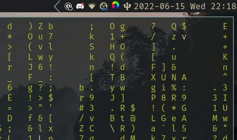

This year I finally moved to Linux from using Windows for 4.5 years. However, there are a few things I missed from Windows, especially being able to see the volume level while adjusting it even when using an application fullscreen. The included Qtile widget wasn't doing it for me so I decided to make my own volume display using *dunstify*.

### Important {.important}
This script is made for a setup using PulseAudio or Pipewire (with *pipewire-pulse*) as an audio server and that has *pamixer* installed. It also requires *dunst* or a compatible notification daemon.

```bash
#!/bin/sh

dunstify \
  "Volume: $(printf "%03d%%" $(pamixer --get-volume))" \
  -i volume-level-high \
  -r 28223 \
  -h int:value:$(pamixer --get-volume)
```

Result:


And then I added it to my keybinds along side with *pamixer* to change the volume and then display it.

``` python
keys = [
	...
	Key([], "XF86AudioRaiseVolume", lazy.spawn("sh -c 'pamixer -i 2; ~/.scripts/display-volume'"), desc="Raise volume"),
	Key([], "XF86AudioLowerVolume", lazy.spawn("sh -c 'pamixer -d 2; ~/.scripts/display-volume'"), desc="Lower volume"),
	...
]
```

### Nerd Note {.note}
I chose the value 28223 for the replacement id, because 6E3F (28223 in hex) is the CRC16 hash of "volume"
